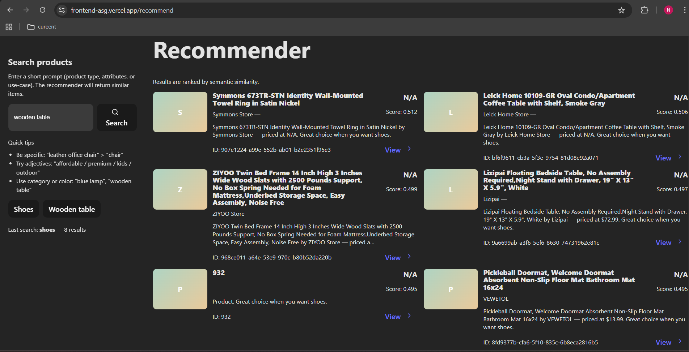

#  AI-Powered Product Recommendation & Analytics System

An end-to-end **AI/ML-powered web application** for intelligent product recommendation, analytics, and description generation — built using **FastAPI (backend)**, **React (frontend)**, and **Machine Learning (NLP + CV + GenAI)** models.

---

## Project Overview

This project demonstrates a **complete AI lifecycle**, from data ingestion and model training to web deployment.  
It integrates:
- **ML** for recommendation
- **NLP** for semantic search and text embeddings
- **CV** for image-based similarity
- **GenAI** for automatic product description generation
- **Analytics** for product insights and dashboards

---

##  Features

✅ Intelligent product recommendations using text embeddings  
✅ Generative AI for automatic product descriptions  
✅ Analytics dashboard (Recharts) for insights  
✅ Support for both **text-based** and **image-based** queries  
✅ FastAPI backend with modular routes (`/ingest`, `/recommend`, `/analytics`)  
✅ React frontend with clean UI (Vite + Axios + Tailwind + Recharts)  
✅ Containerized deployment using **Docker Compose**  
✅ Two Jupyter Notebooks for ML & Analytics workflow  

---





## Tech Stack

| Layer | Tools / Frameworks |
|--------|--------------------|
| **Frontend** | React (Vite), TailwindCSS, Axios, Recharts |
| **Backend** | FastAPI, Uvicorn, LangChain, Pinecone / Local Vector Store |
| **ML/NLP** | Sentence Transformers (`all-MiniLM-L6-v2`), scikit-learn |
| **CV** | Pillow, NumPy (color histogram features) |
| **GenAI** | LangChain + OpenAI / HuggingFace (optional) |
| **Data Visualization** | Recharts, Matplotlib, Seaborn |
| **Deployment** | Docker, Docker Compose, Nginx |
| **Version Control** | Git + GitHub |

---

## Architecture Overview

            ┌──────────────────────────┐
            │        Frontend          │
            │  React + Vite + Recharts │
            └─────────────┬────────────┘
                          │  (Axios REST API)
                          ▼
            ┌──────────────────────────┐
            │         Backend           │
            │ FastAPI + LangChain + ML │
            ├─────────────┬────────────┤
            │             │             │
    ┌────────────┐ ┌────────────┐ ┌────────────┐
    │ NLP Engine │ │ CV Module  │ │ Analytics  │
    │ Embeddings │ │ Image Feat │ │ Summary API│
    └────────────┘ └────────────┘ └────────────┘
                          │
                          ▼
                  ┌────────────┐
                  │   Dataset  │
                  │ products.csv │
                  └────────────┘

---

##  Key Components

### 1. Machine Learning (Model_Training.ipynb)
- Uses **Sentence Transformers** (`all-MiniLM-L6-v2`) to generate embeddings.
- Computes similarity with **cosine similarity**.
- Evaluates performance using **Recall@K** metrics.
- Stores embeddings for use in backend APIs.

###  2. Data Analytics (Analytics.ipynb)
- Performs **EDA** on `products.csv`.
- Visualizes brand distribution, price ranges, and category spread.
- Computes summary stats: average price, total products, etc.

###  3. NLP + GenAI
- Embeddings enable semantic search.
- LangChain/OpenAI used for generating creative descriptions.

###  4. Computer Vision (cv_model.py)
- Extracts **color histogram features** from product images.
- Enables visual similarity-based recommendations.

###  5. Frontend (React + Vite)
- Simple UI with routes:
  - `/recommend` → search & recommendations
  - `/analytics` → charts & summary stats
- Communicates with backend using Axios.

###  6. Backend (FastAPI)
Endpoints:
| Endpoint | Description |
|-----------|--------------|
| `/ingest/` | Uploads or indexes dataset |
| `/recommend/` | Returns similar products |
| `/analytics/summary` | Returns dataset statistics |
| `/` | Root health check |

---

## 🐳 Running Locally with Docker

###  Prerequisites
- [Docker Desktop](https://www.docker.com/products/docker-desktop/)
- Git

---

###  1. Clone the Repository
```bash
git clone https://github.com/Nitika13/product-recommender.git
cd product-recommender

